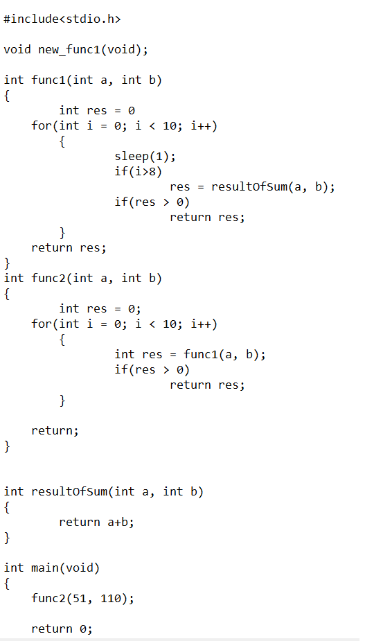
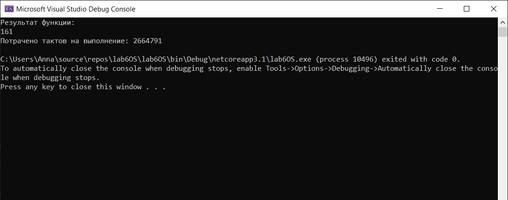
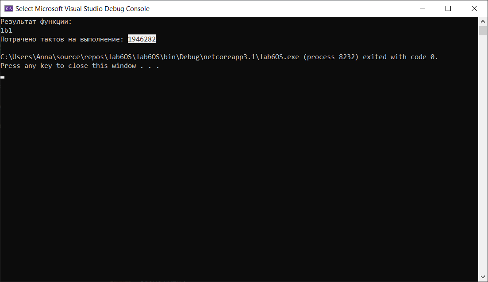

# OSLab6 Профілювання 
Профілювання - збір характеристик роботи програми з метою зрозуміти наскільки ефективно працює програма і які зміни на яких ділянках програми варто робити для подальшої оптимізації.
Існує ручний і інструментальний підхід до профілювання програм.
Ручний спосіб - розстановка вимірів часу вручну.
Інструментальні засоби аналізу програми універсальні і дозволяють збирати велику інформацію про поведінку програми. 
Профілювальник - інструмент аналізу продуктивності програми. У даній л.б. буде використовуватись профілювальник для С# .NET Memory Profiler

### Початковий код на С



Оскільки початкий код був з помилками і не компілився, мною було прийнято рішення переписати його на більш зручну мені мову С#
```
class Program
    {
        public static int resultOfSum(int a, int b)
        {
            return a + b;
        }

        public static int func1(int a, int b)
        {
            int res = 0;
            for(int i = 0; i<10; i++)
            {
                Thread.Sleep(1);
                if (i > 8) res = resultOfSum(a, b);
                if (res > 0) return res;
            }
            return res;
        }

        public static int func2(int a, int b)
        {
            int res = 0;
            for (int i = 0; i < 10; i++)
            {
                 res = func1(a, b);
                if (res > 0)
                    return res;
            }

            return res;
        }
        static void Main(string[] args)
        {
            long ellapledTicks = DateTime.Now.Ticks;

            Console.WriteLine("Результат функции:");
            Console.WriteLine(func2(51,110));
            ellapledTicks = DateTime.Now.Ticks - ellapledTicks;
            Console.WriteLine("Потрачено тактов на выполнение: " + ellapledTicks);

        }
    }
```
### Час виконання неоптимізованого коду:


### Отримані результати після профілювання:



### Результати


Як бачимо, профілювання допомогло, час виконання роботи програми зменшився ~1,5 рази.
